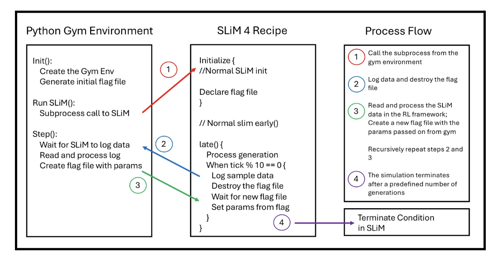

# Summary
Wright-Fisher evolutionary dynamics provide a mathematical framework for modeling populations over discrete time steps [@Fisher:1930]. Deep reinforcement learning (RL) has proven highly effective in optimizing complex sequential decisions, achieving expert-level performance in domains like Poker and Go [@Heinrich:2016; @Silver:2016]. However, applying RL to evolutionary problems requires suitable training environments. We present `SLiM-Gym`, a Python package that bridges this gap by connecting the `Gymnasium` RL framework with `SLiM`, a forward-time population genetics simulator, enabling researchers to apply RL methods to study evolutionary processes and generate novel hypotheses.

# Statement of Need
Evolutionary trajectories are shaped by the interaction of genetic forces acting sequentially across generations. While theoretical models like Wright-Fisher capture these dynamics with well-defined transition probabilities, unified tools for studying and controlling evolutionary processes through reinforcement learning have been limited. Recent work demonstrated the potential of reinforcement learning for controlling ecological and physiological aspects of evolution [@Bagley:2025], optimizing breeding programs [@Younis:2024] and addressing emergent drug resistance [@Engelhardt:2020]. However, these implementations rely on custom simulation tools, potentially limiting accessibility for population geneticists. Reinforcement learning has also been applied to phylogenetic tree space [@Azouri:2023] and ancestral recombination graph construction [@Raymond:2024], highlighting the broader potential of RL in evolutionary biology.

`SLiM` [@Haller:2023] has emerged as a popular forward-time population genetics simulator, with extensive adoption among population geneticists. It excels at modeling complex evolutionary scenarios with individual-level resolution and supports extensive customization through its Eidos scripting language. However, it lacks agentic optimization or exploration. `Gymnasium` [@Towers:2024], originally released as Gym by OpenAI in 2016 [@Brockman:2016], provides a standardized framework for RL research, while environments like MuJoCo, an advanced physics simulator [@Todorov:2012],  illustrate the value of coupling RL with high-fidelity simulations. `SLiM-Gym` combines `SLiM`'s evolutionary modeling with `Gymnasium`'s RL framework, allowing us to leverage RL to generate testable hypotheses about evolutionary processes and outcomes.

# `SLiM-Gym` Wrapper
The base wrapper extends `Gymnasium` with modifications for `SLiM` integration. When initializing a new training episode, the wrapper launches `SLiM` as a subprocess to run a user-defined simulation recipe as an agentic environment. Communication between `Gymnasium` and `SLiM` occurs through a file-based protocol, enabling real-time manipulation of simulation parameters. The wrapper provides abstract methods that environments must implement to handle state processing, action translation, and reward calculation.

# Communication Protocol

The `SLiM-Gym` communication protocol begins by starting the `SLiM` subprocess and initializing a signaling file. During initialization and burn-in generations, `SLiM` operates independently of Python. Once this phase is complete, synchronization between both `SLiM` and `SLiM-Gym` is achieved through two mechanisms: `SLiM`'s output logging and the signaling file. After burn-in, `SLiM` logs generation data and deletes the signaling file, entering a waiting state. The wrapper's step function monitors for both presence of the log file and absence of the signaling file, proceeding to execute when both conditions are met. The action generated by the learning algorithm is written to a new signaling file, lifting `SLiM`'s waiting condition and allowing the action to be applied to the simulation before continuing. The process is visualized in Figure \@ref(fig:slim-communication).

# Reference Environment
We provide a `SLiM` recipe as a reference environment for modeling a $K$-allele Wright–Fisher process with mutation, formulated as a partially observable Markov decision process (POMDP). While the classical Wright–Fisher model assumes a fixed population size, `SLiM-Gym` relaxes this constraint by allowing the population size $N$ to vary over time according to a hidden growth or decay model. The agent interacts with the system by dynamically adjusting the mutation rate $\mu$ in response to the dynamic impacting $N$.

The underlying simulation state at generation $n$ includes the allele frequency vector $X_n^N = (p_1, \ldots, p_K)$ and a mutation parameter $\mu$. In each generation, the agent selects an action corresponding to the next mutation rate $\mu_{n+1}$. `SLiM` then applies the evolutionary steps, such as mutation, where each allele $i$ transitions to allele $j$ with probability $\mu_{ij}$, and draws the resulting allele counts for the next generation from a multinomial distribution with parameters $N_{n+1}$ and the post-mutation frequencies.

The agent does not directly observe $X_n^N$, $N$, or $\mu$. Instead, it observes a site frequency spectrum (SFS), represented as a fixed-length, 100-element vector where each entry corresponds to a 1% frequency bucket. During an initial burn-in phase, the environment establishes an expected SFS under constant $N$ and $\mu$.

The reward function evaluates how well the agent maintains the expected site frequency distribution by calculating the Kullback–Leibler divergence between the observed and expected SFS distributions. Since the population size $N$ is consistently modified by a hidden demographic model and never revealed, the agent must adapt $\mu_{n+1}$ based solely on the observed SFS. This provides a theoretically tractable, biologically grounded test case for RL in evolutionary dynamics.

# Conclusion
The application of reinforcement learning algorithms to evolutionary scenarios represents an exciting direction for future research. RL offers a novel way to approach open questions in evolutionary biology by allowing agents to develop process-driven hypotheses about evolutionary dynamics. `SLiM-Gym` enables this exploratory framework, where agent-derived strategies can be scientifically evaluated, advancing our understanding of complex systems.

# Acknowledgements
Todo

# References

